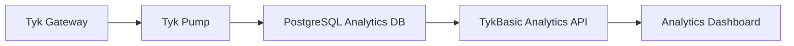

# TykBasic Next Steps Proposal

## 🎯 Current State Summary

TykBasic has achieved **production-ready status** for core key management functionality. The application successfully:
- ✅ Creates and manages API keys through Tyk Gateway
- ✅ Provides unified, responsive user interface
- ✅ Handles Tyk Gateway API integration correctly
- ✅ Stores key metadata with standardized naming
- ✅ Offers comprehensive error handling and validation

## 🚀 Recommended Development Path

### 🏃‍♂️ **IMMEDIATE PRIORITIES** (Next 1-2 Sprints)

#### 1. Authentication System Completion
**Why Critical**: Currently missing self-registration and admin approval workflow
- **Implementation**: Complete Phase 3 (Authentication System)
- **Effort**: 2-3 weeks
- **Impact**: Enables multi-user deployment and proper access control

**Key Tasks:**
```javascript
// Priority order
1. Self-registration with email whitelist validation
2. Admin approval workflow for new users
3. Password reset functionality  
4. Account lockout protection
5. Two-factor authentication (2FA) - Optional for MVP
```

#### 2. Admin Management Interface
**Why Critical**: Required for managing users and system configuration
- **Implementation**: Build admin dashboard (Phase 5.5)
- **Effort**: 1-2 weeks
- **Impact**: Enables proper user management and system administration

**Key Components:**
```javascript
// Admin Dashboard Components
- UserManagement.js      // Approve/reject/suspend users
- EmailWhitelist.js      // Manage allowed email patterns
- SystemConfig.js        // Global system settings
- AuditLogs.js          // Security and action logging
- PendingUsers.js       // User approval workflow
```

### 🔒 **HIGH PRIORITY** (Sprints 3-5)

#### 3. Certificate Management System
**Why Important**: Enables enterprise-grade mTLS authentication
- **Implementation**: Complete Phase 4.4 (Certificate Management)
- **Effort**: 2-3 weeks
- **Impact**: Unlocks advanced authentication methods for enterprise clients

**Technical Implementation:**
```javascript
// Certificate Management Features
- Certificate upload and validation
- Certificate generation utilities (openssl integration)
- Certificate expiration monitoring and alerts
- mTLS authentication flow setup
- Certificate revocation capabilities
```

#### 4. Enhanced API Management
**Why Important**: Currently can only create APIs, need full CRUD operations
- **Implementation**: Complete Phase 4.5 (API Management)
- **Effort**: 2-3 weeks
- **Impact**: Full API lifecycle management

**Key Features:**
```javascript
// API Management Enhancements
- Update existing API configurations
- Delete APIs from Tyk Gateway
- API versioning support
- OpenAPI Specification (OAS) import/export
- Advanced proxy configuration options
```

### 📊 **MEDIUM PRIORITY** (Sprints 6-8)

#### 5. Analytics & Monitoring Integration
**Why Valuable**: Provides insights into API usage and performance
- **Implementation**: Phase 10.5 (Analytics Integration)
- **Effort**: 3-4 weeks
- **Impact**: Business intelligence and monitoring capabilities

**Architecture:**


#### 6. Enhanced Security & Compliance
**Why Important**: Production security hardening
- **Implementation**: Phase 7 (Security Implementation)
- **Effort**: 2-3 weeks
- **Impact**: Enterprise-ready security posture

### 🔧 **LOWER PRIORITY** (Future Sprints)

#### 7. Performance Optimization
- Caching implementation (Redis)
- Database query optimization
- Bundle size optimization
- CDN setup for static assets

#### 8. Advanced Features
- HMAC signature authentication
- Organization-level management
- API rate limiting templates
- Custom authentication plugins

## 📋 Detailed Implementation Plan

### **Sprint 1-2: Authentication Foundation**

#### Week 1: Core Authentication
```javascript
// Backend Implementation
1. AuthService.js - Complete authentication logic
2. EmailWhitelist model and validation
3. PendingUser model and approval workflow
4. Password reset email functionality
5. Account lockout after failed attempts

// Frontend Implementation  
1. Registration form with email validation
2. Password reset flow components
3. Email verification page
4. Account activation flow
```

#### Week 2: Admin Features
```javascript
// Admin Dashboard Components
1. AdminDashboard.js - Main admin interface
2. UserManagement.js - User approval/management
3. EmailWhitelist.js - Whitelist pattern management
4. SystemConfig.js - Global configuration
5. Admin authentication middleware
```

### **Sprint 3-4: Certificate Management**

#### Week 3: Certificate Infrastructure
```javascript
// Backend Certificate Handling
1. CertificateService.js - Upload/validation logic
2. Certificate storage and metadata management
3. OpenSSL integration for certificate generation
4. Certificate expiration monitoring

// Database Schema
1. certificates table
2. certificate_metadata table
3. certificate_access_grants table
```

#### Week 4: mTLS Authentication
```javascript
// Frontend Certificate UI
1. CertificateUpload.js - File upload component
2. CertificateGeneration.js - Generate new certificates
3. CertificateList.js - Manage existing certificates
4. mTLS setup wizard

// Tyk Integration
1. mTLS policy configuration
2. Certificate-based key creation
3. Certificate validation flow
```

### **Sprint 5-6: API Management Enhancement**

#### Week 5: API CRUD Operations
```javascript
// API Management Features
1. Update API configurations
2. Delete APIs from Tyk Gateway
3. API versioning support
4. Advanced proxy settings

// Frontend Components
1. ApiEditor.js - Edit existing APIs
2. ApiVersioning.js - Version management
3. ProxyConfig.js - Advanced proxy settings
```

#### Week 6: OpenAPI Integration
```javascript
// OAS Support
1. OpenAPI spec import/export
2. API documentation generation
3. Swagger UI integration
4. Schema validation
```

## 🎯 Success Metrics

### Phase A Completion (Authentication)
- [ ] Users can self-register with email whitelist
- [ ] Admins can approve/reject pending users  
- [ ] Password reset flow works end-to-end
- [ ] Account lockout protects against brute force
- [ ] Admin dashboard provides full user management

### Phase B Completion (Certificates)
- [ ] Upload and validate X.509 certificates
- [ ] Generate new certificates with proper metadata
- [ ] mTLS authentication works with Tyk Gateway
- [ ] Certificate expiration alerts function
- [ ] Certificate revocation capabilities

### Phase C Completion (API Management)
- [ ] Full CRUD operations on APIs
- [ ] OpenAPI spec import/export
- [ ] API versioning and rollback
- [ ] Advanced proxy configuration
- [ ] API documentation generation

## 💡 Architectural Considerations

### Database Evolution
```sql
-- New tables needed for next phases
CREATE TABLE email_whitelist (
    id UUID PRIMARY KEY,
    pattern VARCHAR(255) NOT NULL,
    description TEXT,
    created_at TIMESTAMP DEFAULT NOW()
);

CREATE TABLE pending_users (
    id UUID PRIMARY KEY,
    email VARCHAR(255) NOT NULL,
    password_hash VARCHAR(255) NOT NULL,
    verification_token VARCHAR(255),
    expires_at TIMESTAMP,
    created_at TIMESTAMP DEFAULT NOW()
);

CREATE TABLE certificates (
    id UUID PRIMARY KEY,
    user_id UUID REFERENCES users(id),
    name VARCHAR(255) NOT NULL,
    certificate_data TEXT NOT NULL,
    private_key_data TEXT,
    fingerprint VARCHAR(255),
    expires_at TIMESTAMP,
    is_active BOOLEAN DEFAULT true,
    created_at TIMESTAMP DEFAULT NOW()
);
```

### Service Layer Expansion
```javascript
// New service classes needed
- AuthService.js         // Complete authentication logic
- EmailService.js        // Email sending and templates
- CertificateService.js  // Certificate management
- AdminService.js        // Admin operations
- AnalyticsService.js    // Usage analytics (future)
```

## 📈 Timeline & Resource Estimates

### **Phase A: Authentication (2-3 weeks)**
- **Developer Effort**: 60-80 hours
- **Complexity**: Medium
- **Dependencies**: Email service configuration
- **Risk**: Low (well-established patterns)

### **Phase B: Certificates (3-4 weeks)**  
- **Developer Effort**: 80-100 hours
- **Complexity**: High
- **Dependencies**: OpenSSL knowledge, PKI understanding
- **Risk**: Medium (certificate handling complexity)

### **Phase C: Analytics (3-4 weeks)**
- **Developer Effort**: 80-120 hours  
- **Complexity**: Medium-High
- **Dependencies**: Tyk Pump configuration, PostgreSQL
- **Risk**: Medium (external dependencies)

## 🔄 Deployment Strategy

### Rolling Deployment Approach
1. **Authentication First**: Enables multi-user access
2. **Certificates Second**: Unlocks enterprise features
3. **Analytics Third**: Provides business value
4. **Performance Last**: Optimizes existing features

### Feature Flags Recommended
```javascript
// Feature flag configuration
const features = {
  selfRegistration: true,
  certificateManagement: false,  // Enable after Phase B
  analyticsIntegration: false,   // Enable after Phase C
  advancedApiManagement: false   // Enable incrementally
};
```

---

## 🎉 Conclusion

TykBasic is in an excellent position with a solid foundation and working core features. The recommended next steps focus on **authentication completion** as the highest priority, followed by **certificate management** for enterprise readiness, and **analytics integration** for business value.

This roadmap provides a clear path to a fully-featured, enterprise-ready Tyk Gateway management application while maintaining the current momentum and production-ready status. 